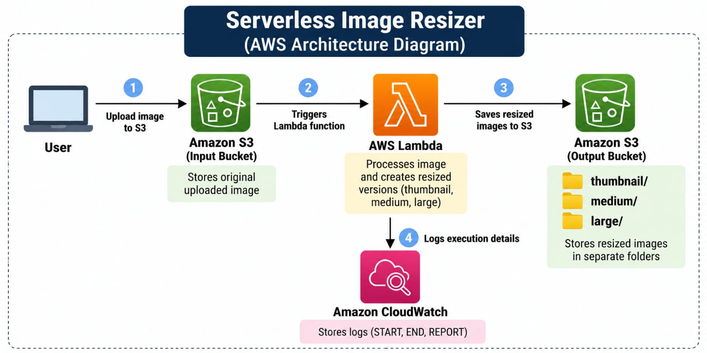
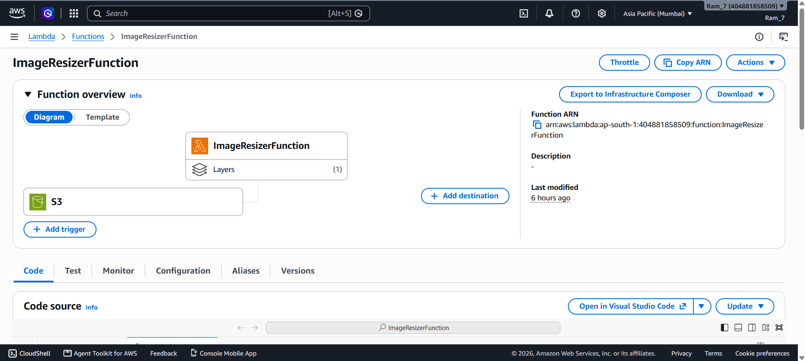
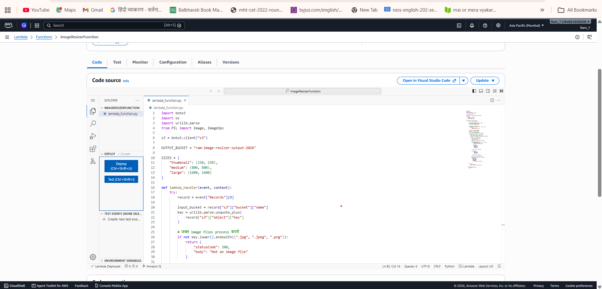
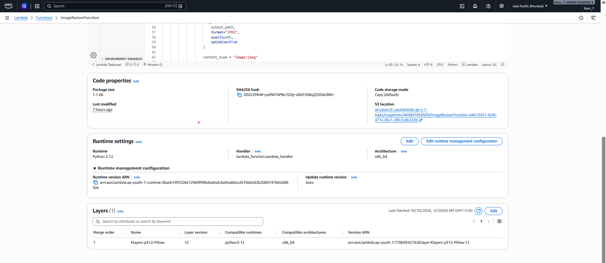
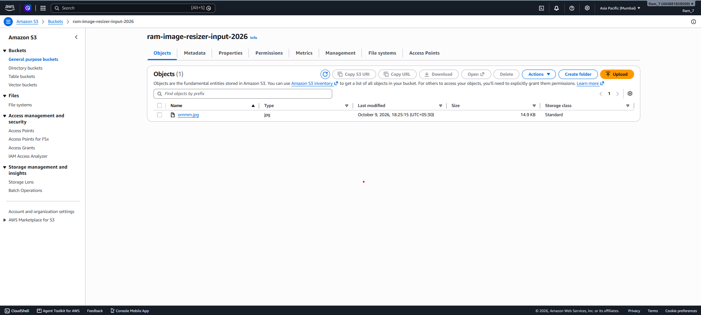
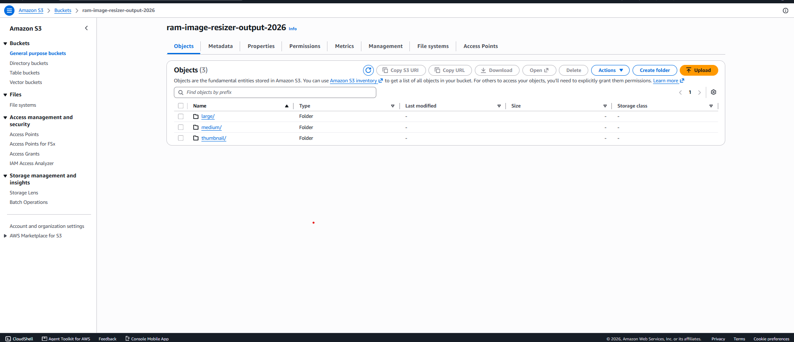
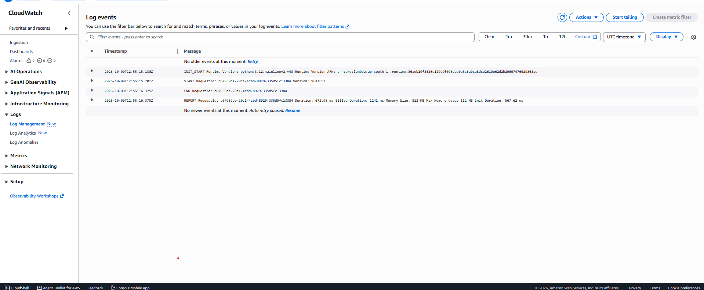

# Serverless Image Resizer using AWS

## Project Overview

This project is a serverless image resizing system built using AWS services.

When an image is uploaded to the input Amazon S3 bucket, it automatically triggers an AWS Lambda function. The Lambda function uses Python and the Pillow library to resize the image into three different sizes: thumbnail, medium, and large. The resized images are then stored in a separate S3 output bucket.

## Architecture

### Project Flow

User → S3 Input Bucket → AWS Lambda → S3 Output Bucket

AWS Lambda → Amazon CloudWatch Logs

## AWS Services Used

- Amazon S3
- AWS Lambda
- AWS IAM
- Amazon CloudWatch
- Python
- Pillow Library

## Implementation

1. Created an S3 bucket for uploading original images.
2. Created a separate S3 bucket for resized images.
3. Created an IAM role with required S3 and CloudWatch permissions.
4. Created the `ImageResizerFunction` AWS Lambda function.
5. Added the Pillow library using a Lambda Layer.
6. Configured the input S3 bucket to automatically trigger Lambda when an image is uploaded.
7. Lambda processes the uploaded image and creates three sizes:
   - Thumbnail: 150 × 150
   - Medium: 800 × 800
   - Large: 1600 × 1600
8. Resized images are stored in the output S3 bucket.
9. Lambda execution is monitored using Amazon CloudWatch.

## Lambda Function Overview

The S3 event automatically triggers the Lambda function whenever a new image is uploaded.

## Lambda Code

The Lambda function downloads the original image, processes it using Pillow, and uploads the resized versions to the output bucket.

The complete source code is available in [`lambda_function.py`](lambda_function.py).

## Pillow Layer

The Pillow library is added as a Lambda Layer and is used for image processing.

## S3 Input Bucket

The input bucket stores the original uploaded image.

## S3 Output Bucket

The output bucket stores the resized images in separate `thumbnail`, `medium`, and `large` folders.

## CloudWatch Logs

CloudWatch logs confirm successful Lambda execution using START, END, and REPORT log entries.

## Security

AWS IAM is used to provide the Lambda function only the permissions required for this project.

The Lambda function has permission to:

- Read images from the input S3 bucket.
- Write resized images to the output S3 bucket.
- Write execution logs to Amazon CloudWatch.

The S3 buckets are kept private.

## Failure Handling

If image processing fails, Lambda records the error in Amazon CloudWatch Logs. These logs can be used to identify and troubleshoot the problem.

Unsupported files are ignored by the Lambda function.

## Production Improvements

For a production environment, the project can be improved by:

- Adding a Dead Letter Queue (DLQ) for failed Lambda executions.
- Adding CloudWatch alarms for errors.
- Using environment variables instead of hardcoding the output bucket name.
- Adding stronger file validation.
- Using AWS KMS encryption where required.
- Adding lifecycle rules to reduce S3 storage costs.

## Project Result

The complete serverless workflow was successfully tested.

Uploading an image to the input S3 bucket automatically triggers Lambda and generates thumbnail, medium, and large versions in the output S3 bucket.

## Author

Ram
